# 101-Coconsülting

101-Coconsülting is a ficticious software consulting firm created for the
purposes of the project made by students of group 101 (later 501) of the
courses TC3004B and TC3005B of Tec de Monterrey Campus Santa Fe for Ditta
Consulting, our formative partners. The project was carried out during the
February-June 2025 semester, and resulted in the creation of the project
repository [TC3005B.501](https://github.com/101-Coconsulting/TC3005B.501).

The name originated from the group number (101), as well as being effectively a
consultancy for a consulting firm. The `101` is also meant to represent binary,
the _ü_ is meant to resemble a happy face, and the coconut comes from the _coco_
part of Co-Consulting Ditta Consulting; _coco_ means coconut in Spanish. Hence 
101 Coconsülting.

## Slogan

> Solid and refreshing solutions. 

## Logo

## Vision 

At Coconsülting, we seek to expand into a professional market by contributing
to the improvement and optimization of systems within Mexican companies. Our
robust solutions provide support in the creation and management of systems for
our clients. We aim to be one of the leading companies in Mexico for supporting
technological systems with the most optimal solutions.

## Mision 

To help our clients develop comprehensive solutions for their needs, we are
committed to implementing innovative technologies that allow us to provide
cutting-edge service. Our goal is to position ourselves as the best option for
technological solutions in the market.

## Values

Honesty, respect, teamwork, learning, patience, tolerance, innovation,
resilience, robustness, solidity, and freshness. 

## Our team

The entire group was part of the project, and we all contributed jointly to its
development. We had 2 main project leadership teams:

1. PM (Project Manager)
2. LA (Lead Architect)

Whose members were mostly absorbed into the following 4 development teams due
to the intense requirements of the project development.

1. Frontend
2. Backend
3. DataBase
4. Security

Each team was in charge of a different part of the project and each had their
own internal hierarchies for management and for leadership.

### Organigram

```mermaid
---
config:
  layout: elk
---
flowchart TD
    subgraph PM
        paydelimon22
        click paydelimon22 "https://github.com/paydelimon22" "Open
        paydelimon22's profile on GitHub" _blank
        JoseGlezMtz
        click JoseGlezMtz "https://github.com/JoseGlezMtz" "Open JoseGlezMtz's
        profile on GitHub" _blank
    end
    subgraph LA
        BassedWarrior
        click BassedWarrior "https://github.com/BassedWarrior" "Open
        BassedWarrior's profile on GitHub" _blank
        MESC2004    
        click MESC2004 "https://github.com/BassedWarrior" "Open MESC2004's profile on GitHub" _blank
    end
    subgraph Security
        luisda25
        click luisda25 "https://github.com/luisda25" "Open luisda25's profile on GitHub" _blank
        RoSosaTEC
        click RoSosaTEC "https://github.com/RoSosaTEC" "Open RoSosaTEC's profile on GitHub" _blank
        
        luisda25 --- RoSosaTEC
    end
    subgraph Frontend
        Porto1090
        click Porto1090 "https://github.com/Porto1090" "Open Porto1090's profile on GitHub" _blank
        juliaduenk
        click juliaduenk "https://github.com/juliaduenk" "Open juliaduenk's profile on GitHub" _blank
        Tootiz
        click Tootiz "https://github.com/Toootiz" "Open Tootiz's profile on
        GitHub" _blank
        HJZR2004
        click HJZR2004 "https://github.com/HJZR2004" "Open HJZR2004's profile on GitHub" _blank
        A01799073
        click A01799073 "https://github.com/A01799073" "Open A01799073's profile on GitHub" _blank
        SnakeJazzzz
        click SnakeJazzzz "https://github.com/SnakeJazzzz" "Open SnakeJazzzz's profile on GitHub" _blank
        cyb3rn3t
        click cyb3rn3t "https://github.com/cyb3rn3t" "Open cyb3rn3t's profile on GitHub" _blank
        SKKYWall
        click SKKYWall "https://github.com/SKKYWall" "Open SKKYWall's profile on GitHub" _blank

        Porto1090 --- juliaduenk --- Tootiz & HJZR2004 & A01799073 & SnakeJazzzz & cyb3rn3t & SKKYWall
    end
    subgraph Backend
        subgraph API
            direction TB
            andresjaramillo7
            click andresjaramillo7 "https://github.com/andresjaramillo7" "Open
            andresjaramillo7's profile on GitHub" _blank
            dmop02
            click dmop02 "https://github.com/dmop02" "Open dmop02's profile on
            GitHub" _blank
            NelOsdJuaDua
            click NelOsdJuaDua "https://github.com/NelOsdJuaDua" "Open
            NelOsdJuaDua's profile on GitHub" _blank
            RicardoCalvoP
            click RicardoCalvoP "https://github.com/RicardoCalvoP" "Open
            RicardoCalvoP's profile on GitHub" _blank
            diegovalencia0
            click diegovalencia0 "https://github.com/diegovalencia0" "Open
            diegovalencia0's profile on GitHub" _blank

            andresjaramillo7 --- dmop02 & NelOsdJuaDua & RicardoCalvoP & diegovalencia0
        end
        subgraph DataBase
            direction TB
            a01029143
            click a01029143 "https://github.com/a01029143" "Open a01029143's profile on GitHub" _blank
            A09271
            click A09271 "https://github.com/A09271" "Open A09271's profile on GitHub" _blank
            natrogue
            click natrogue "https://github.com/natrogue" "Open natrogue's profile on GitHub" _blank
            EnriqueMartinezdeVR
            click EnriqueMartinezdeVR "https://github.com/EnriqueMartinezdeVR" "Open EnriqueMartinezdeVR's profile on GitHub" _blank
            FernandoF8970
            click FernandoF8970 "https://github.com/FernandoF8970" "Open FernandoF8970's profile on GitHub" _blank

            a01029143 --- A09271 --- natrogue & EnriqueMartinezdeVR & FernandoF8970
        end
    end
    PM & LA --- Security --- Frontend & Backend
```

